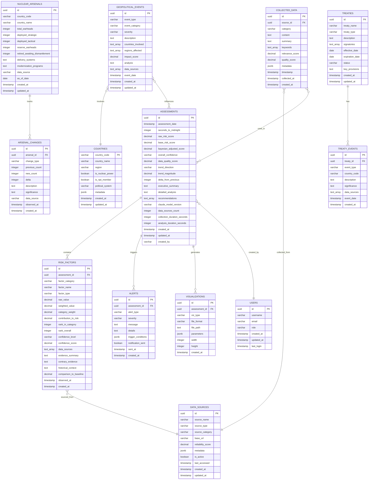

# WarGames/JOSHUA: Comprehensive System Diagrams
## Visual Architecture and Design Documentation
### Version 1.0.0 | October 2025

---

## Table of Contents

1. [System Architecture Overview](#1-system-architecture-overview)
2. [Module Hierarchy](#2-module-hierarchy)
3. [Data Flow Diagrams](#3-data-flow-diagrams)
4. [Database Schema (ERD)](#4-database-schema-erd)
5. [Risk Calculation Workflow](#5-risk-calculation-workflow)
6. [Claude API Integration](#6-claude-api-integration)
7. [Data Collection Process](#7-data-collection-process)
8. [Component Interaction](#8-component-interaction)
9. [Deployment Architecture](#9-deployment-architecture)
10. [State Machines](#10-state-machines)
11. [Testing Architecture](#11-testing-architecture)
12. [Security Architecture](#12-security-architecture)
13. [Scheduling and Automation](#13-scheduling-and-automation)
14. [Error Handling Flow](#14-error-handling-flow)
15. [Notification System](#15-notification-system)

---

## 1. System Architecture Overview

### 1.1 High-Level Component Architecture


### 1.2 Layered Architecture View


---

## 2. Module Hierarchy

### 2.1 Rust Crate Structure


### 2.2 Engine Dependencies


---

## 3. Data Flow Diagrams

### 3.1 Complete Assessment Flow


### 3.2 Data Collection Detail Flow


---

## 4. Database Schema (ERD)

### 4.1 Core Schema



### 4.2 Indexing Strategy


---

## 5. Risk Calculation Workflow

### 5.1 Multi-Stage Risk Calculation


### 5.2 Factor Weighting Hierarchy


---

## 6. Claude API Integration

### 6.1 Analysis Request Sequence


### 6.2 Prompt Engineering Flow


---

## 7. Data Collection Process

### 7.1 Parallel Collection Architecture


### 7.2 Data Quality Scoring


---

## 8. Component Interaction

### 8.1 Engine Communication Diagram


### 8.2 Event Flow Diagram


---

## 9. Deployment Architecture

### 9.1 Production Deployment


### 9.2 Container Architecture (Docker/K8s)


---

## 10. State Machines

### 10.1 Assessment Lifecycle State Machine


### 10.2 Data Collector State Machine


---

## 11. Testing Architecture

### 11.1 Test Pyramid

```mermaid
graph TB
    subgraph PYRAMID["Test Pyramid"]
        E2E[End-to-End Tests<br/>Complete Assessment Flow<br/>~10 tests]
        
        INT[Integration Tests<br/>Component Interactions<br/>~50 tests]
        
        UNIT[Unit Tests<br/>Individual Functions<br/>~500+ tests]
    end
    
    subgraph TYPES["Test Types"]
        FUNC[Functional Tests]
        PERF[Performance Tests]
        SEC[Security Tests]
        CHAOS[Chaos Tests]
        PROP[Property Tests]
    end
    
    subgraph COVERAGE["Coverage Goals"]
        LINE[Line Coverage:<br/>95%+]
        BRANCH[Branch Coverage:<br/>90%+]
        FUNC_COV[Function Coverage:<br/>100%]
    end
    
    subgraph CI["CI/CD Pipeline"]
        COMMIT[Commit]
        LINT[Linting<br/>clippy]
        FMT[Formatting<br/>rustfmt]
        BUILD[Build]
        TEST_RUN[Run Tests]
        COV_CHECK[Coverage Check]
        BENCH[Benchmarks]
        DEPLOY[Deploy]
    end
    
    E2E --> INT
    INT --> UNIT
    
    UNIT --> FUNC
    INT --> FUNC
    E2E --> FUNC
    
    UNIT --> PERF
    INT --> PERF
    
    UNIT --> SEC
    INT --> SEC
    
    INT --> CHAOS
    E2E --> CHAOS
    
    UNIT --> PROP
    
    FUNC --> LINE
    FUNC --> BRANCH
    FUNC --> FUNC_COV
    
    COMMIT --> LINT
    LINT --> FMT
    FMT --> BUILD
    BUILD --> TEST_RUN
    TEST_RUN --> COV_CHECK
    COV_CHECK --> BENCH
    BENCH --> DEPLOY
    
    style E2E fill:#ff6b6b
    style INT fill:#ffe66d
    style UNIT fill:#4ecdc4
    style LINE fill:#5fb96b
    style BRANCH fill:#5fb96b
    style FUNC_COV fill:#5fb96b
```

### 11.2 Test Data Flow

```mermaid
flowchart LR
    subgraph FIXTURES["Test Fixtures"]
        MOCK_NEWS[Mock News Data]
        MOCK_SIPRI[Mock SIPRI Data]
        MOCK_CLAUDE[Mock Claude Responses]
        MOCK_DB[Mock Database]
    end
    
    subgraph GENERATORS["Data Generators"]
        GEN_ARTICLES[Article Generator]
        GEN_ARSENALS[Arsenal Generator]
        GEN_EVENTS[Event Generator]
        GEN_SCORES[Score Generator]
    end
    
    subgraph TESTS["Test Suites"]
        UNIT_TESTS[Unit Tests]
        INT_TESTS[Integration Tests]
        E2E_TESTS[E2E Tests]
    end
    
    subgraph ASSERTIONS["Assertions"]
        ASSERT_DATA[Data Quality]
        ASSERT_CALC[Calculations Correct]
        ASSERT_OUTPUT[Output Format]
        ASSERT_PERF[Performance Metrics]
    end
    
    subgraph REPORTS["Test Reports"]
        COV_REPORT[Coverage Report]
        PERF_REPORT[Performance Report]
        FAIL_REPORT[Failure Report]
    end
    
    MOCK_NEWS --> UNIT_TESTS
    MOCK_SIPRI --> UNIT_TESTS
    MOCK_CLAUDE --> UNIT_TESTS
    MOCK_DB --> UNIT_TESTS
    
    GEN_ARTICLES --> INT_TESTS
    GEN_ARSENALS --> INT_TESTS
    GEN_EVENTS --> INT_TESTS
    GEN_SCORES --> INT_TESTS
    
    MOCK_NEWS --> E2E_TESTS
    MOCK_SIPRI --> E2E_TESTS
    MOCK_CLAUDE --> E2E_TESTS
    MOCK_DB --> E2E_TESTS
    
    UNIT_TESTS --> ASSERT_DATA
    UNIT_TESTS --> ASSERT_CALC
    
    INT_TESTS --> ASSERT_DATA
    INT_TESTS --> ASSERT_CALC
    INT_TESTS --> ASSERT_OUTPUT
    
    E2E_TESTS --> ASSERT_OUTPUT
    E2E_TESTS --> ASSERT_PERF
    
    ASSERT_DATA --> COV_REPORT
    ASSERT_CALC --> COV_REPORT
    ASSERT_OUTPUT --> COV_REPORT
    ASSERT_PERF --> PERF_REPORT
    
    ASSERT_DATA -.failures.-> FAIL_REPORT
    ASSERT_CALC -.failures.-> FAIL_REPORT
    ASSERT_OUTPUT -.failures.-> FAIL_REPORT
    ASSERT_PERF -.failures.-> FAIL_REPORT
    
    style FIXTURES fill:#4ecdc4
    style GENERATORS fill:#ffe66d
    style TESTS fill:#ff6b6b
    style ASSERTIONS fill:#f9ca24
    style REPORTS fill:#95e1d3
```

---

## 12. Security Architecture

### 12.1 Security Layers

```mermaid
graph TB
    subgraph EDGE["Edge Security"]
        TLS[TLS 1.3<br/>Encryption]
        WAF[Web Application<br/>Firewall]
        DDOS[DDoS<br/>Protection]
        RATELIMIT[Rate Limiting]
    end
    
    subgraph AUTH["Authentication & Authorization"]
        API_KEY[API Key<br/>Management]
        TOKEN[Token<br/>Validation]
        RBAC[Role-Based<br/>Access Control]
    end
    
    subgraph APP["Application Security"]
        INPUT_VAL[Input<br/>Validation]
        OUTPUT_ENC[Output<br/>Encoding]
        CSRF[CSRF<br/>Protection]
        XSS[XSS<br/>Prevention]
    end
    
    subgraph DATA["Data Security"]
        ENCRYPT_REST[Encryption<br/>at Rest]
        ENCRYPT_TRANSIT[Encryption<br/>in Transit]
        KEY_MGMT[Key Management<br/>AES-256-GCM]
        SECRETS[Secrets<br/>Management]
    end
    
    subgraph AUDIT["Audit & Monitoring"]
        ACCESS_LOG[Access<br/>Logging]
        AUDIT_TRAIL[Audit<br/>Trail]
        ANOMALY[Anomaly<br/>Detection]
        SIEM[SIEM<br/>Integration]
    end
    
    subgraph COMPLIANCE["Compliance"]
        GDPR[GDPR<br/>Compliance]
        SOC2[SOC 2<br/>Controls]
        BACKUP[Backup &<br/>Recovery]
        RETENTION[Data<br/>Retention]
    end
    
    TLS --> AUTH
    WAF --> AUTH
    DDOS --> AUTH
    RATELIMIT --> AUTH
    
    AUTH --> APP
    
    APP --> DATA
    
    DATA --> AUDIT
    
    AUDIT --> COMPLIANCE
    
    API_KEY -.encrypts.-> KEY_MGMT
    TOKEN -.validates.-> RBAC
    
    INPUT_VAL -.sanitizes.-> DATA
    
    ENCRYPT_REST --> KEY_MGMT
    ENCRYPT_TRANSIT --> KEY_MGMT
    
    ACCESS_LOG --> SIEM
    AUDIT_TRAIL --> SIEM
    ANOMALY --> SIEM
    
    style TLS fill:#4ecdc4
    style WAF fill:#4ecdc4
    style API_KEY fill:#ffe66d
    style RBAC fill:#ffe66d
    style INPUT_VAL fill:#f9ca24
    style ENCRYPT_REST fill:#f38181
    style ENCRYPT_TRANSIT fill:#f38181
    style KEY_MGMT fill:#f38181
    style AUDIT_TRAIL fill:#aa96da
```

### 12.2 API Key Encryption Flow

```mermaid
sequenceDiagram
    participant USER as User/Config
    participant APP as Application
    participant CRYPTO as Crypto Utils
    participant KEYSTORE as Key Store
    participant EXTERNAL as External API
    
    Note over USER,KEYSTORE: Initial Setup
    USER->>APP: Provide API Key
    APP->>CRYPTO: encrypt_api_key(key)
    activate CRYPTO
    CRYPTO->>CRYPTO: Generate random salt
    CRYPTO->>CRYPTO: Derive encryption key<br/>from master password
    CRYPTO->>CRYPTO: Encrypt with AES-256-GCM
    CRYPTO-->>APP: encrypted_key
    deactivate CRYPTO
    APP->>KEYSTORE: store(encrypted_key, salt)
    
    Note over APP,EXTERNAL: API Usage
    APP->>KEYSTORE: retrieve(key_id)
    KEYSTORE-->>APP: encrypted_key, salt
    APP->>CRYPTO: decrypt_api_key(encrypted_key, salt)
    activate CRYPTO
    CRYPTO->>CRYPTO: Derive decryption key
    CRYPTO->>CRYPTO: Decrypt
    CRYPTO-->>APP: plaintext_key
    deactivate CRYPTO
    
    APP->>EXTERNAL: API Request with key
    EXTERNAL-->>APP: API Response
    
    Note over APP: Key never stored in plaintext<br/>Key in memory only during use
    APP->>APP: Zero out plaintext_key
```

---

## 13. Scheduling and Automation

### 13.1 Scheduler Architecture

```mermaid
graph TB
    subgraph SCHEDULER["Task Scheduling Engine"]
        CRON[Cron Parser]
        QUEUE[Task Queue]
        EXECUTOR[Task Executor]
        MONITOR[Job Monitor]
    end
    
    subgraph JOBS["Scheduled Jobs"]
        ASSESS_MONTHLY[Monthly Assessment<br/>1st of month, 00:00 UTC]
        ASSESS_WEEKLY[Weekly Check<br/>Monday, 06:00 UTC]
        NEWS_HOURLY[News Collection<br/>Every hour]
        RESEARCH_DAILY[Research Update<br/>Daily, 06:00 UTC]
        CLEANUP[Database Cleanup<br/>Weekly, Sunday 02:00 UTC]
        BACKUP[Backup Task<br/>Daily, 03:00 UTC]
    end
    
    subgraph EXECUTION["Execution Flow"]
        CHECK_TIME[Check Schedule]
        CREATE_TASK[Create Task Instance]
        ENQUEUE[Enqueue Task]
        EXEC_TASK[Execute Task]
        CHECK_STATUS[Check Status]
        HANDLE_RESULT[Handle Result]
    end
    
    subgraph RECOVERY["Error Recovery"]
        RETRY[Retry Logic]
        FALLBACK[Fallback Strategy]
        ALERT_ADMIN[Alert Admin]
        LOG_ERROR[Log Error]
    end
    
    CRON --> CHECK_TIME
    CHECK_TIME --> CREATE_TASK
    CREATE_TASK --> ENQUEUE
    
    ENQUEUE --> QUEUE
    QUEUE --> EXECUTOR
    
    EXECUTOR --> EXEC_TASK
    EXEC_TASK --> CHECK_STATUS
    CHECK_STATUS --> HANDLE_RESULT
    
    ASSESS_MONTHLY --> CRON
    ASSESS_WEEKLY --> CRON
    NEWS_HOURLY --> CRON
    RESEARCH_DAILY --> CRON
    CLEANUP --> CRON
    BACKUP --> CRON
    
    HANDLE_RESULT -.failure.-> RETRY
    RETRY -.max retries.-> FALLBACK
    FALLBACK --> ALERT_ADMIN
    RETRY --> LOG_ERROR
    
    MONITOR --> CHECK_STATUS
    MONITOR --> LOG_ERROR
    
    style CRON fill:#4ecdc4
    style QUEUE fill:#ffe66d
    style EXECUTOR fill:#ff6b6b
    style ASSESS_MONTHLY fill:#f9ca24
    style RETRY fill:#f38181
```

### 13.2 Cron Expression Examples

```mermaid
graph LR
    subgraph CRON_PATTERNS["Cron Schedule Patterns"]
        MONTHLY["0 0 1 * *<br/>Monthly: 1st day, midnight"]
        WEEKLY["0 6 * * 1<br/>Weekly: Monday 6AM"]
        DAILY["0 6 * * *<br/>Daily: 6AM UTC"]
        HOURLY["0 * * * *<br/>Hourly: Top of hour"]
        CUSTOM1["0 */6 * * *<br/>Every 6 hours"]
        CUSTOM2["0 2 * * 0<br/>Weekly: Sunday 2AM"]
    end
    
    subgraph TASKS["Associated Tasks"]
        T1[Full Assessment]
        T2[Trend Analysis]
        T3[Data Collection]
        T4[News Monitoring]
        T5[Research Updates]
        T6[Database Cleanup]
    end
    
    MONTHLY --> T1
    WEEKLY --> T2
    DAILY --> T3
    HOURLY --> T4
    CUSTOM1 --> T5
    CUSTOM2 --> T6
    
    style MONTHLY fill:#ff6b6b
    style WEEKLY fill:#4ecdc4
    style DAILY fill:#ffe66d
    style HOURLY fill:#f9ca24
    style T1 fill:#f38181
```

---

## 14. Error Handling Flow

### 14.1 Error Handling Strategy

```mermaid
flowchart TD
    ERROR([Error Occurs])
    
    CLASSIFY{Classify Error Type}
    
    TRANSIENT[Transient Error<br/>Network, Timeout, Rate Limit]
    PERMANENT[Permanent Error<br/>Invalid Data, Auth Failure]
    CRITICAL[Critical Error<br/>System Failure, Data Loss]
    
    RETRY_CHECK{Retry Count < Max?}
    BACKOFF[Exponential Backoff<br/>Wait & Retry]
    
    FALLBACK{Fallback Available?}
    USE_FALLBACK[Use Fallback Strategy<br/>Cached Data, Default Values]
    
    LOG[Log Error Details<br/>Stack Trace, Context]
    METRIC[Update Error Metrics<br/>Prometheus Counter]
    
    ALERT{Alert Threshold?}
    SEND_ALERT[Send Alert to Admins<br/>Slack/Email/PagerDuty]
    
    RECOVER{Can Recover?}
    GRACEFUL[Graceful Degradation<br/>Partial Functionality]
    FAIL[Fail Operation<br/>Return Error to User]
    
    STORE[Store Error in Database<br/>For Analysis]
    
    END([Complete Error Handling])
    
    ERROR --> CLASSIFY
    
    CLASSIFY --> TRANSIENT
    CLASSIFY --> PERMANENT
    CLASSIFY --> CRITICAL
    
    TRANSIENT --> RETRY_CHECK
    RETRY_CHECK -->|Yes| BACKOFF
    RETRY_CHECK -->|No| FALLBACK
    BACKOFF --> RETRY_CHECK
    
    PERMANENT --> FALLBACK
    
    CRITICAL --> LOG
    CRITICAL --> METRIC
    CRITICAL --> SEND_ALERT
    
    FALLBACK -->|Yes| USE_FALLBACK
    FALLBACK -->|No| LOG
    
    USE_FALLBACK --> LOG
    
    LOG --> METRIC
    METRIC --> ALERT
    
    ALERT -->|Yes| SEND_ALERT
    ALERT -->|No| RECOVER
    
    SEND_ALERT --> RECOVER
    
    RECOVER -->|Yes| GRACEFUL
    RECOVER -->|No| FAIL
    
    GRACEFUL --> STORE
    FAIL --> STORE
    
    STORE --> END
    
    style ERROR fill:#ff6b6b
    style TRANSIENT fill:#ffe66d
    style PERMANENT fill:#f9ca24
    style CRITICAL fill:#f38181
    style USE_FALLBACK fill:#4ecdc4
    style GRACEFUL fill:#5fb96b
    style FAIL fill:#ff6b6b
    style END fill:#95e1d3
```

### 14.2 Error Types Taxonomy

```mermaid
graph TB
    ROOT[WarGamesError]
    
    subgraph DATA_ERRORS["Data Collection Errors"]
        NETWORK[NetworkError]
        TIMEOUT[TimeoutError]
        PARSE[ParseError]
        SOURCE[SourceUnavailableError]
        QUALITY[DataQualityError]
    end
    
    subgraph API_ERRORS["API Errors"]
        AUTH[AuthenticationError]
        RATE[RateLimitError]
        QUOTA[QuotaExceededError]
        API_FAIL[APIFailureError]
    end
    
    subgraph CALC_ERRORS["Calculation Errors"]
        INVALID[InvalidInputError]
        OVERFLOW[OverflowError]
        CONVERGENCE[ConvergenceError]
        INSUFFICIENT[InsufficientDataError]
    end
    
    subgraph STORAGE_ERRORS["Storage Errors"]
        DB[DatabaseError]
        CACHE[CacheError]
        FILE[FileSystemError]
    end
    
    subgraph SYSTEM_ERRORS["System Errors"]
        CONFIG[ConfigurationError]
        RESOURCE[ResourceExhaustedError]
        DEPENDENCY[DependencyError]
    end
    
    ROOT --> NETWORK
    ROOT --> TIMEOUT
    ROOT --> PARSE
    ROOT --> SOURCE
    ROOT --> QUALITY
    
    ROOT --> AUTH
    ROOT --> RATE
    ROOT --> QUOTA
    ROOT --> API_FAIL
    
    ROOT --> INVALID
    ROOT --> OVERFLOW
    ROOT --> CONVERGENCE
    ROOT --> INSUFFICIENT
    
    ROOT --> DB
    ROOT --> CACHE
    ROOT --> FILE
    
    ROOT --> CONFIG
    ROOT --> RESOURCE
    ROOT --> DEPENDENCY
    
    style ROOT fill:#ff6b6b
    style DATA_ERRORS fill:#4ecdc4
    style API_ERRORS fill:#ffe66d
    style CALC_ERRORS fill:#f9ca24
    style STORAGE_ERRORS fill:#f38181
    style SYSTEM_ERRORS fill:#aa96da
```

---

## 15. Notification System

### 15.1 Alert Flow

```mermaid
flowchart TD
    START([Risk Score Calculated])
    
    CHECK[Check Alert Conditions]
    
    THRESHOLD{Meets Threshold?}
    
    CRITICAL{Critical<br/>< 100 seconds?}
    SEVERE{Severe<br/>< 200 seconds?}
    HIGH{High<br/>< 400 seconds?}
    TREND{Significant<br/>Trend Change?}
    
    PREPARE[Prepare Alert Message]
    
    FORMAT[Format Message:<br/>- Risk Score<br/>- Trend Direction<br/>- Primary Drivers<br/>- Recommendations]
    
    CHANNELS{Active Channels?}
    
    EMAIL[Send Email<br/>SMTP]
    SLACK[Send Slack<br/>Webhook]
    WEBHOOK[Send Custom<br/>Webhook]
    SMS[Send SMS<br/>Twilio]
    
    LOG[Log Alert Sent]
    STORE[Store in Database]
    
    THROTTLE{Rate Limited?}
    
    WAIT[Wait Cooldown Period]
    
    END([Complete])
    
    START --> CHECK
    CHECK --> THRESHOLD
    
    THRESHOLD -->|Yes| CRITICAL
    THRESHOLD -->|No| END
    
    CRITICAL -->|Yes| PREPARE
    CRITICAL -->|No| SEVERE
    
    SEVERE -->|Yes| PREPARE
    SEVERE -->|No| HIGH
    
    HIGH -->|Yes| PREPARE
    HIGH -->|No| TREND
    
    TREND -->|Yes| PREPARE
    TREND -->|No| END
    
    PREPARE --> FORMAT
    FORMAT --> THROTTLE
    
    THROTTLE -->|Yes| WAIT
    THROTTLE -->|No| CHANNELS
    
    WAIT --> END
    
    CHANNELS --> EMAIL
    CHANNELS --> SLACK
    CHANNELS --> WEBHOOK
    CHANNELS --> SMS
    
    EMAIL --> LOG
    SLACK --> LOG
    WEBHOOK --> LOG
    SMS --> LOG
    
    LOG --> STORE
    STORE --> END
    
    style START fill:#95e1d3
    style CRITICAL fill:#ff6b6b
    style SEVERE fill:#ff6b6b
    style HIGH fill:#ffe66d
    style TREND fill:#ffe66d
    style EMAIL fill:#4ecdc4
    style SLACK fill:#4ecdc4
    style WEBHOOK fill:#4ecdc4
    style END fill:#95e1d3
```

### 15.2 Alert Escalation

```mermaid
stateDiagram-v2
    [*] --> Monitoring
    
    Monitoring --> LowRisk: Score > 600s
    Monitoring --> ModerateRisk: 400s < Score  600s
    Monitoring --> HighRisk: 200s < Score  400s
    Monitoring --> SevereRisk: 100s < Score  200s
    Monitoring --> CriticalRisk: Score  100s
    
    LowRisk --> Monitoring: Score Improves
    LowRisk --> ModerateRisk: Score Deteriorates
    
    ModerateRisk --> LowRisk: Score Improves
    ModerateRisk --> HighRisk: Score Deteriorates
    ModerateRisk --> NotifyTeam: Alert Threshold
    
    HighRisk --> ModerateRisk: Score Improves
    HighRisk --> SevereRisk: Score Deteriorates
    HighRisk --> NotifyLeadership: Escalation Level 1
    
    SevereRisk --> HighRisk: Score Improves
    SevereRisk --> CriticalRisk: Score Deteriorates
    SevereRisk --> NotifyExecutives: Escalation Level 2
    
    CriticalRisk --> SevereRisk: Score Improves
    CriticalRisk --> EmergencyProtocol: Immediate Action Required
    
    NotifyTeam --> ModerateRisk: Acknowledged
    NotifyLeadership --> HighRisk: Acknowledged
    NotifyExecutives --> SevereRisk: Acknowledged
    EmergencyProtocol --> CriticalRisk: Initiated
    
    note right of ModerateRisk
        Send to: Development Team
        Method: Slack, Email
        Frequency: Once per change
    end note
    
    note right of HighRisk
        Send to: Team Leads, Security
        Method: Slack, Email, Dashboard
        Frequency: Every assessment
    end note
    
    note right of SevereRisk
        Send to: Executives, Security Team
        Method: All channels + SMS
        Frequency: Continuous monitoring
    end note
    
    note right of CriticalRisk
        Send to: All stakeholders
        Method: ALL CHANNELS
        Frequency: Real-time alerts
        Action: Emergency protocols
    end note
```

---

## Conclusion

This comprehensive diagram collection provides visual documentation of every major aspect of the WarGames/JOSHUA nuclear risk assessment system. These diagrams serve as:

1. **Architecture Reference**: Complete system design and component relationships
2. **Implementation Guide**: Detailed flows for developers implementing features
3. **Operations Manual**: Deployment, monitoring, and error handling procedures
4. **Communication Tool**: Explaining system design to stakeholders
5. **Onboarding Resource**: Helping new team members understand the system

### Usage Guidelines

- **Development**: Reference module hierarchy and data flow diagrams during implementation
- **Deployment**: Use deployment architecture diagrams for infrastructure setup
- **Troubleshooting**: Consult error handling and state machine diagrams
- **Optimization**: Review component interaction and performance-critical paths
- **Security**: Reference security architecture for compliance and audits

### Diagram Maintenance

These diagrams should be updated whenever:
- Major architectural changes occur
- New components are added
- Integration patterns change
- Deployment strategy evolves
- Security controls are modified

*"The only winning move is not to play  but if we must monitor the game, we visualize every aspect with precision and clarity."*

---

**Document Version**: 1.0.0  
**Last Updated**: October 2025  
**Maintained By**: WarGames/JOSHUA Development Team  
**Review Frequency**: Quarterly or after major changes
